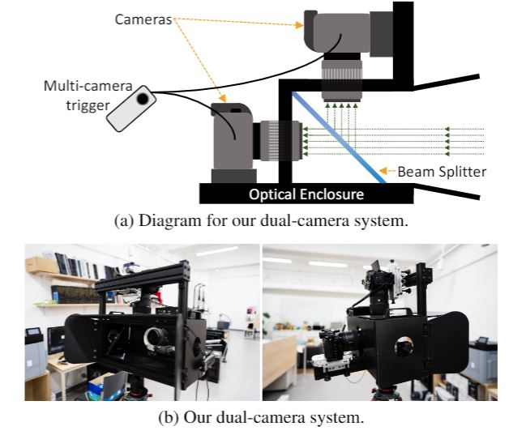

# IFAN: Iterative Filter Adaptive Network for Single Image Defocus Deblurring<br><sub>Official PyTorch Implementation of the CVPR 2021 Paper</sub>

[](https://colab.research.google.com/drive/1DmazbJPUlx4MF9-Z9llvddlywxlLWxsX?usp=sharing)
[](https://replicate.ai/codeslake/ifan-defocus-deblur)
[-blue.svg?style=flat)](https://YJ5YKNVB7BY5PN7Y.anvil.app/KNK4MOE27FW3VZNDQUNHAJAY)


This repo contains training and evaluation code for the following paper:

> **[Iterative Filter Adaptive Network for Single Image Defocus Deblurring](https://www.dropbox.com/s/33ix3yzqz0q7xce/IFAN_main.pdf?raw=1)**<br>
> Junyong Lee, Hyeongseok Son, Jaesung Rim, Sunghyun Cho, and Seungyong Lee<br>
> *IEEE Computer Vision and Pattern Recognition (**CVPR**) 2021*


<p align="left">
  <a href="https://codeslake.github.io/publications/#IFAN">
    
  </a><br>
</p>

## About the Research
<details>
    <summary><i>Click here</i></summary>
        <h2> Iterative Filter Adaptive Network (IFAN) </h2>
        <p align="center">
          
        </p>
        <p> Our deblurring network is built upon a simple encoder-decoder architecture consisting of a feature extractor, reconstructor, and IFAN module in the middle. The feature extractor extracts defocused features and feeds them to IFAN. IFAN removes blur in the feature domain by predicting spatially-varying deblurring filters and applying them to the defocused features using IAC. The deblurred features from IFAN is then passed to the reconstructor, which restores an all-in-focus image.
        </p>
        <h3> Iterative Adaptive Convolution Layer </h3>
        <p> The IAC layer iteratively computes feature maps  as follows (refer Eq. 1 in the main paper): </p>
        <p align="center">
            
        </p>
        <p align="center">
            
        </p>
        <p>
            Separable filters in our IAC layer play a key role in resolving the limitation of <a href="https://jiaya.me/papers/inversekernel_eccv14.pdf">the FAC layer</a>. Our IAC layer secures larger receptive fields at much lower memory and computational costs than the FAC layer by utilizing 1-dim filters, instead of 2-dim convolutions. However, compared to dense 2-dim convolution filters in the FAC layer, our separable filters may not provide enough accuracy for deblurring filters. We handle this problem by iteratively applying separable filters to fully exploit the non-linear nature of a deep network. Our iterative scheme also enables small-sized separable filters to be used for establishing large receptive fields.
        </p>
        <h3> Disparity Map Estimation & Reblurring </h3>
        <p> To further improve the single image deblurring quality, we train our network with novel defocus-specific tasks: defocus disparity estimation and reblurring. </p>
        <p align="center">
            
        </p>
        <p>
            <b>Disparity Map Estimation</b> exploits dual-pixel data, which provides stereo images with a tiny baseline, whose disparities are proportional to defocus blur magnitudes.
            Leveraging dual-pixel stereo images, we train IFAN to predict the disparity map from a single image so that it can also learn to more accurately predict blur magnitudes.
        </p>
        <p align="center">
            
        </p>
        <p>
            <b>Reblurring</b>, motivated by <a href="https://arxiv.org/pdf/1801.05117v1.pdf">the reblur-to-deblur scheme</a>, utilizes deblurring filters predicted by IFAN for reblurring all-in-focus images.
            For accurate reblurring, IFAN needs to predict deblurring filters that contain accurate information about the shapes and sizes of defocus blur.
            Based on this, during training, we introduce an additional network that inverts predicted deblurring filters to reblurring filters, and reblurs an all-in-focus image.
        </p>
        <h2> The Real Depth of Field (RealDOF) test set </h2>
        <p align="center">
            
        </p>
        <p>
            We present the <a href="https://www.dropbox.com/s/arox1aixvg67fw5/RealDOF.zip?dl=1">Real Depth of Field (RealDOF) test set</a> for quantitative and qualitative evaluations of single image defocus deblurring. Our RealDOF test set contains 50 image pairs, each of which consists of a defocused image and its corresponding all-in-focus image that have been concurrently captured for the same scene, with the dual-camera system. Refer Sec. 1 in the supplementary material for more details.
        </p>
</details>

## Getting Started
### Prerequisites

*Tested environment*


#### 1. Environment setup
```bash
$ git clone https://github.com/codeslake/IFAN.git
$ cd IFAN

$ conda create -y --name IFAN python=3.8 && conda activate IFAN
# for CUDA10.2
$ sh install_CUDA10.2.sh
# for CUDA11.1
$ sh install_CUDA11.1.sh
```

#### 2. Datasets
Download and unzip test sets (DPDD: [<i class="fab fa-google-drive"></i>](https://drive.google.com/open?id=1Mq7WtYMo9mRsJ6I6ccXdY1JJQvwBuMuQ&authuser=codeslake%40gmail.com&usp=drive_fs) | [<i class="fa-brands fa-dropbox"></i>](https://www.dropbox.com/s/w9urn5m4mzllrwu/DPDD.zip?dl=1), [PixelDP](https://www.dropbox.com/s/pw7w2bpp7pc410n/PixelDP.zip?dl=1), [CUHK](https://www.dropbox.com/s/zxjhzuxsxh4v0cv/CUHK.zip?dl=1) and [RealDOF](https://www.dropbox.com/s/arox1aixvg67fw5/RealDOF.zip?dl=1)) under `[DATASET_ROOT]`:

```
[DATASET_ROOT]
 ├── DPDD
 ├── PixelDP
 ├── CUHK
 └── RealDOF
```
> `[DATASET_ROOT]` can be modified with [`config.data_offset`](https://github.com/codeslake/IFAN/blob/main/configs/config.py#L48-L49) in `./configs/config.py`.

#### 3. Pre-trained models
Download and unzip pretrained weights ([<i class="fab fa-google-drive"></i>](https://drive.google.com/open?id=1MnoyTZgHgG7vwZYuloLeQgegwa6O9A7O&authuser=codeslake%40gmail.com&usp=drive_fs) | [<i class="fa-brands fa-dropbox"></i>](https://www.dropbox.com/s/qohhmr9p81u0syi/checkpoints.zip?dl=1)) under `./ckpt/`:

```
.
├── ...
├── ./ckpt
│   ├── IFAN.pytorch
│   ├── ...
│   └── IFAN_dual.pytorch
└── ...
```

## Testing models of CVPR 2021

```shell
## Table 2 in the main paper
# Our final model used for comparison
CUDA_VISIBLE_DEVICES=0 python run.py --mode IFAN --network IFAN --config config_IFAN --data DPDD --ckpt_abs_name ckpt/IFAN.pytorch

## Table 4 in the main paper
# Our final model with N=8
CUDA_VISIBLE_DEVICES=0 python run.py --mode IFAN_8 --network IFAN --config config_IFAN_8 --data DPDD --ckpt_abs_name ckpt/IFAN_8.pytorch

# Our final model with N=26
CUDA_VISIBLE_DEVICES=0 python run.py --mode IFAN_26 --network IFAN --config config_IFAN_26 --data DPDD --ckpt_abs_name ckpt/IFAN_26.pytorch

# Our final model with N=35
CUDA_VISIBLE_DEVICES=0 python run.py --mode IFAN_35 --network IFAN --config config_IFAN_35 --data DPDD --ckpt_abs_name ckpt/IFAN_35.pytorch

# Our final model with N=44
CUDA_VISIBLE_DEVICES=0 python run.py --mode IFAN_44 --network IFAN --config config_IFAN_44 --data DPDD --ckpt_abs_name ckpt/IFAN_44.pytorch

## Table 1 in the supplementary material
# Our model trained with 16 bit images
CUDA_VISIBLE_DEVICES=0 python run.py --mode IFAN_16bit --network IFAN --config config_IFAN_16bit --data DPDD --ckpt_abs_name ckpt/IFAN_16bit.pytorch

## Table 2 in the supplementary material
# Our model taking dual-pixel stereo images as an input
CUDA_VISIBLE_DEVICES=0 python run.py --mode IFAN_dual --network IFAN_dual --config config_IFAN --data DPDD --ckpt_abs_name ckpt/IFAN_dual.pytorch
```

> Testing results will be saved in `[LOG_ROOT]/IFAN_CVPR2021/[mode]/result/quanti_quali/[mode]_[epoch]/[data]/`.

> `[LOG_ROOT]` can be modified with [`config.log_offset`](https://github.com/codeslake/IFAN/blob/main/configs/config.py#L65) in `./configs/config.py`.

#### Options
* `--data`: The name of a dataset to evaluate. `DPDD` | `RealDOF` | `CUHK` | `PixelDP` | `random`. Default: `DPDD`
    * The folder structure can be modified in the function [`set_eval_path(..)`](https://github.com/codeslake/IFAN/blob/main/configs/config.py#L114-L139) in `./configs/config.py`.
    * `random` is for testing models with any images, which should be placed as `[DATASET_ROOT]/random/*.[jpg|png]`.

## Wiki
* [Logging](https://github.com/codeslake/IFAN/wiki/Log-Details)
* [Training and testing details](https://github.com/codeslake/IFAN/wiki/Training-&-Testing-Details).

## Contact
Open an issue for any inquiries.
You may also have contact with [junyonglee@postech.ac.kr](mailto:junyonglee@postech.ac.kr)

## Resources
All material related to our paper is available by following links:

| Link |
| :-------------- |
| [The main paper](https://www.dropbox.com/s/33ix3yzqz0q7xce/IFAN_main.pdf?raw=1) |
| [Supplementary](https://www.dropbox.com/s/6wv6ppxsaofbix6/IFAN_supp.pdf?raw=1) |
| [Checkpoint Files](https://www.dropbox.com/s/qohhmr9p81u0syi/checkpoints.zip?dl=1) |
| [The DPDD dataset](https://www.dropbox.com/s/w9urn5m4mzllrwu/DPDD.zip?dl=1) ([reference](https://github.com/Abdullah-Abuolaim/defocus-deblurring-dual-pixel)) |
| [The PixelDP test set](https://www.dropbox.com/s/pw7w2bpp7pc410n/PixelDP.zip?dl=1) ([reference](https://ln2.sync.com/dl/ec54aa480/b28q2xma-9xa3w5tx-ss2cv7dg-2yx935qs/view/default/10770664900008)) |
| [The CUHK dataset](https://www.dropbox.com/s/zxjhzuxsxh4v0cv/CUHK.zip?dl=1) ([reference](http://www.cse.cuhk.edu.hk/~leojia/projects/dblurdetect/dataset.html)) |
| [The RealDOF test set](https://www.dropbox.com/s/arox1aixvg67fw5/RealDOF.zip?dl=1) |

## License
This software is being made available under the terms in the [LICENSE](LICENSE) file.

Any exemptions to these terms require a license from the Pohang University of Science and Technology.

## Citation
If you find this code useful, please consider citing:

```
@InProceedings{Lee_2021_CVPR,
    author = {Lee, Junyong and Son, Hyeongseok and Rim, Jaesung and Cho, Sunghyun and Lee, Seungyong},
    title = {Iterative Filter Adaptive Network for Single Image Defocus Deblurring},
    booktitle = {IEEE Conference on Computer Vision and Pattern Recognition (CVPR)},
    month = {June},
    year = {2021}
}
```

