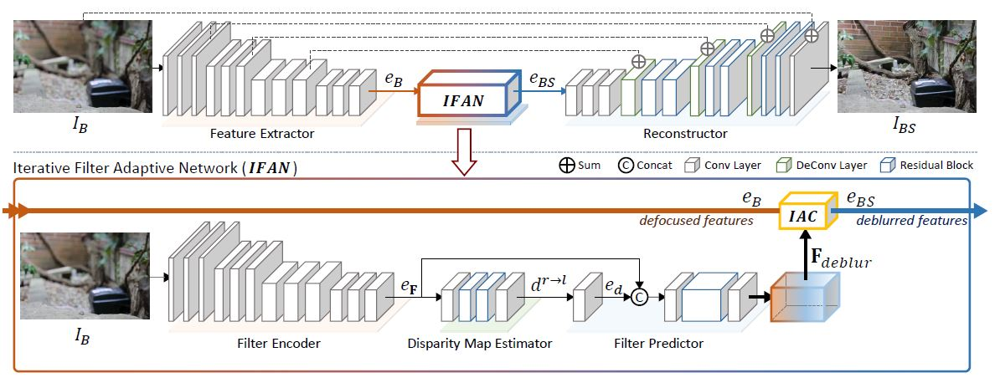
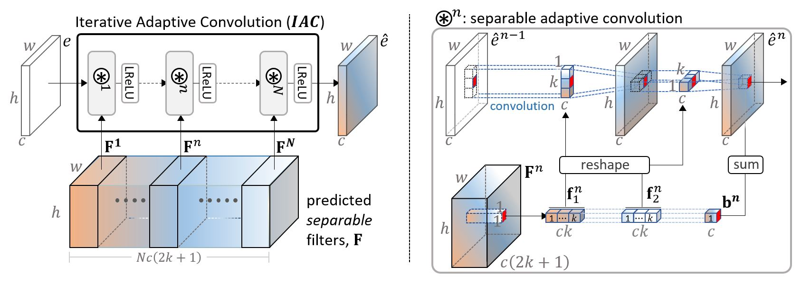
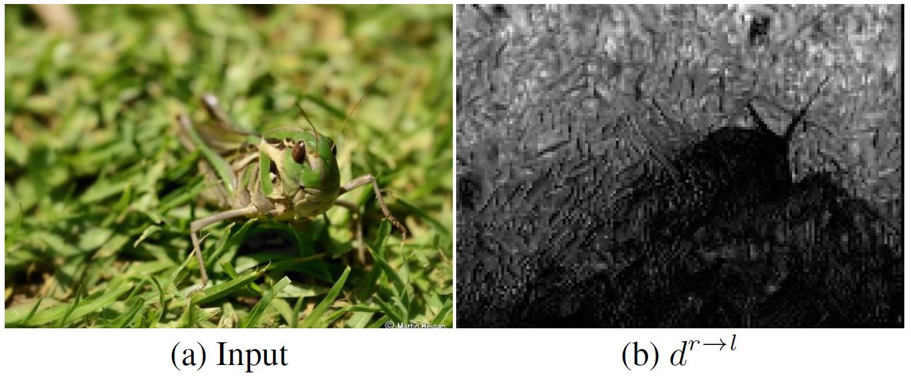
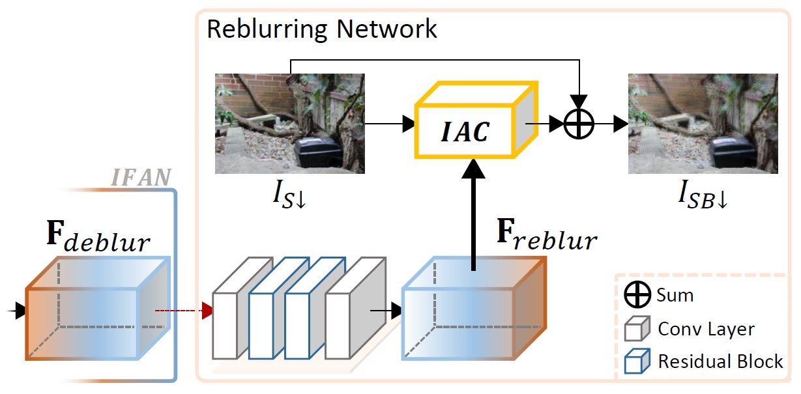

# IFAN: Iterative Filter Adaptive Network for Single Image Defocus Deblurring


***Checkout for the demo ([GUI](https://YJ5YKNVB7BY5PN7Y.anvil.app/KNK4MOE27FW3VZNDQUNHAJAY)/[Google Colab](https://colab.research.google.com/drive/1DmazbJPUlx4MF9-Z9llvddlywxlLWxsX?usp=sharing))!***
<br/>*The GUI version might occasionally be offline*
    
<!-- ***Checkout for the demo in [Google Colab](https://colab.research.google.com/drive/1DmazbJPUlx4MF9-Z9llvddlywxlLWxsX?usp=sharing)*** -->

<p align="center">
  
</p>

This repository contains the official PyTorch implementation of the following paper:

> **[Iterative Filter Adaptive Network for Single Image Defocus Deblurring](http://cg.postech.ac.kr/papers/2020_CGI_JY.pdf)**<br>
> Junyong Lee, Hyeongseok Son, Jaesung Rim, Sunghyun Cho, Seungyong Lee, CVPR 2021


## About the Research
<details>
    <summary><i>Click here</i></summary>
        <h3> Iterative Adaptive Convolution Layer </h3>
        <p> The IAC layer iteratively computes feature maps  as follows (refer Eq. 1 in the main paper): </p>
        <p align="center">
            
        </p>
        <p align="center">
            
        </p>
        <p>
            The proposed IAC layer is inspired by Xu <i>et al.</i>’s <a href="https://jiaya.me/papers/inversekernel_eccv14.pdf">separable inverse filter approach</a> and Zhou <i>et al.</i>’s <a href="http://openaccess.thecvf.com/content_ICCV_2019/papers/Zhou_Spatio-Temporal_Filter_Adaptive_Network_for_Video_Deblurring_ICCV_2019_paper.pdf">FAC layer</a>.
            The IAC layer approximates deblurring filters using a set of separable filters in the feature domain.
            As convolution operations before and after an IAC layer in the feature domain naturally support linear combinations of different channels, the IAC layer can successfully approximate deblurring filters.
        </p>
        <h3> Disparity Map Estimation & Reblurring </h3>
        <p> To further improve the single image deblurring quality, we train our network with novel defocus-specific tasks: defocus disparity estimation and reblurring. </p>
        <p align="center">
            
        </p>
        <p>
            <b>Disparity Map Estimation</b> exploits dual-pixel data, which provides stereo images with a tiny baseline, whose disparities are proportional to defocus blur magnitudes.
            Leveraging dual-pixel stereo images, we train IFAN to predict the disparity map from a single image so that it can also learn to more accurately predict blur magnitudes.
        </p>
        <p align="center">
            
        </p>
        <p>
            <b>Reblurring</b>, motivated by <a href="https://arxiv.org/pdf/1801.05117v1.pdf">the reblur-to-deblur scheme</a>, utilizes deblurring filters predicted by IFAN for reblurring all-in-focus images.
            For accurate reblurring, IFAN needs to predict deblurring filters that contain accurate information about the shapes and sizes of defocus blur.
            Based on this, during training, we introduce an additional network that inverts predicted deblurring filters to reblurring filters, and reblurs an all-in-focus image.
        </p>
</details>

## Getting Started
### Prerequisites

*Tested environment*


1. **Install requirements**
    * `pip install -r requirements.txt`

2. **Datasets**
    * Download and unzip test sets ([DPDD](https://www.dropbox.com/s/w9urn5m4mzllrwu/DPDD.zip?dl=1), [PixelDP](https://www.dropbox.com/s/pw7w2bpp7pc410n/PixelDP.zip?dl=1), [CUHK](https://www.dropbox.com/s/zxjhzuxsxh4v0cv/CUHK.zip?dl=1) and [RealDOF](https://www.dropbox.com/s/arox1aixvg67fw5/RealDOF.zip?dl=1)) under `[DATASET_ROOT]`:

        ```
        ├── [DATASET_ROOT]
        │   ├── DPDD
        │   ├── PixelDP
        │   ├── CUHK
        │   ├── RealDOF
        ```

        > **Note:**
        >
        > * `[DATASET_ROOT]` is currently set to `./datasets/defocus_deblur/`, which can be modified by [`config.data_offset`](https://github.com/codeslake/IFAN/blob/main/configs/config.py#L48-L49) in `./configs/config.py`.

3. **Pre-trained models**
    * Download and unzip [pretrained weights](https://www.dropbox.com/s/qohhmr9p81u0syi/checkpoints.zip?dl=1) under `./ckpt/`:

        ```
        ├── ./ckpt
        │   ├── IFAN.pytorch
        │   ├── ...
        │   ├── IFAN_dual.pytorch
        ``` 

### Logs
* Training and tesing logs will be saved under `[LOG_ROOT]/IFAN_CVPR2021/[mode]/`:

    ```
    ├── [LOG_ROOT]
    │   ├── IFAN_CVPR2021
    │   │   ├── [mode]
    │   │   │   ├── checkpoint      # model checkpoints and resume states
    │   │   │   ├── log             # scalar/image logs for tensorboard
    │   │   │   ├── sample          # sample images of training and validation
    │   │   │   ├── config          # config file
    │   │   │   ├── result          # resulting images of evaluation
    │   │   │   ├── cost.txt        # network size and MACs measured on an image of the size (1, 3, 1280, 720)
    │   │   │   ├── [network].py    # network file
    ```

    * In `./config/config.py`, you may configure following items:
        * [`config.log_offset`](https://github.com/codeslake/IFAN/blob/main/configs/config.py#L66): configures `[LOG_ROOT]`. Default: `./logs`
        * [`config.write_ckpt_every_epoch`](https://github.com/codeslake/IFAN/blob/main/configs/config.py#L59): configures an epoch period for saving checkpoints, resume states and scalar logs. Default: 4
        * [`config.write_log_every_itr`](https://github.com/codeslake/IFAN/blob/main/configs/config.py#L61): configures an iteration period for saving sample images. Default: `{'train':200, 'valid': 1}`
        * [`config.refresh_image_log_every_epoch`](https://github.com/codeslake/IFAN/blob/main/configs/config.py#L60): configures an epoch period for erasing sample images. Defualt: `{'train':20, 'valid':20}`

## Testing models of CVPR2021

```shell
## Table 2 in the main paper
# Our final model used for comparison
CUDA_VISIBLE_DEVICES=0 python run.py --mode IFAN --network IFAN --config config_IFAN --data DPDD --ckpt_abs_name ckpt/IFAN.pytorch

## Table 4 in the main paper
# Our final model with N=8
CUDA_VISIBLE_DEVICES=0 python run.py --mode IFAN_8 --network IFAN --config config_IFAN_8 --data DPDD --ckpt_abs_name ckpt/IFAN_8.pytorch

# Our final model with N=26
CUDA_VISIBLE_DEVICES=0 python run.py --mode IFAN_26 --network IFAN --config config_IFAN_26 --data DPDD --ckpt_abs_name ckpt/IFAN_26.pytorch

# Our final model with N=35
CUDA_VISIBLE_DEVICES=0 python run.py --mode IFAN_35 --network IFAN --config config_IFAN_35 --data DPDD --ckpt_abs_name ckpt/IFAN_35.pytorch

# Our final model with N=44
CUDA_VISIBLE_DEVICES=0 python run.py --mode IFAN_44 --network IFAN --config config_IFAN_44 --data DPDD --ckpt_abs_name ckpt/IFAN_44.pytorch

## Table 1 in the supplementary material
# Our model trained with 16 bit images
CUDA_VISIBLE_DEVICES=0 python run.py --mode IFAN_16bit --network IFAN --config config_IFAN_16bit --data DPDD --ckpt_abs_name ckpt/IFAN_16bit.pytorch

## Table 2 in the supplementary material
# Our model taking dual-pixel stereo images as an input
CUDA_VISIBLE_DEVICES=0 python run.py --mode IFAN_dual --network IFAN_dual --config config_IFAN --data DPDD --ckpt_abs_name ckpt/IFAN_dual.pytorch
```

> **Note:**
>
> * Testing results will be saved in `[LOG_ROOT]/IFAN_CVPR2021/[mode]/result/quanti_quali/[mode]_[epoch]/[data]/`.
* Options
    * `--data`: The name of a dataset to evaluate. `DPDD` | `RealDOF` | `CUHK` | `PixelDP` | `random`. Default: `DPDD`
        * The folder structure can be modified in the function [`set_eval_path(..)`](https://github.com/codeslake/IFAN/blob/main/configs/config.py#L114-L139) in `./configs/config.py`.
        * `random` is for testing models with any images, which should be placed as `[DATASET_ROOT]/random/*.[jpg|png]`. 


## Training & testing the network
### Training

```shell
# multi GPU (with DistributedDataParallel) example
CUDA_VISIBLE_DEVICES=0,1,2,3 python -B -m torch.distributed.launch --nproc_per_node=4 --master_port=9000 run.py \
            --is_train \
            --mode IFAN \
            --config config_IFAN \
            --trainer trainer \
            --network IFAN \
            -b 2 \
            -th 8 \
            -dl \
            -ss \
            -dist

# resuming example (trainer will load checkpoint saved after 100 epoch, training will resume from 101 epoch)
CUDA_VISIBLE_DEVICES=0,1,2,3 python -B -m torch.distributed.launch --nproc_per_node=4 --master_port=9000 run.py \
            ... \
            -th 8 \
            -r 100 \
            -ss \
            -dist

# single GPU (with DataParallel) example
CUDA_VISIBLE_DEVICES=0 python -B run.py \
            ... \
            -ss
```

> **Note:**
>
> * The image loss (MSE) will be applied no matter what.
> * If `IFAN` is included in `[mode]`, it will trigger both disparity and reblurring losses.
> * To separately apply each of the disparity and the reblurring losses, do not include `IFAN` in `[mode]` but trigger each loss by including `D`(for the disparity loss) or `R`(for the reblurring loss) in `[mode]` (*e.g.*, `--mode my_net_D`).
> * To train a network that takes dual-pixel stereo images as an input, `dual` should be included in the option `[mode]`, and `IFAN_dual` should be specified for the option `[network]`.

* Options
    <!--<details>
        <summary><i>Click here</i></summary>
    -->
    * `--is_train`: If it is specified, `run.py` will train the network. Default: `False`
    * `--mode`: The name of a model to train. The logging folder named with the `[mode]` will be created as `[LOG_ROOT]/IFAN_CVPR2021/[mode]/`. Default: `IFAN`
    * `--config`: The name of a config file located as `./config/[config].py`. Default: `None`, and the default should not be changed.
    * `--trainer`: The name of a trainer file located as `./models/trainers/[trainer].py`. Default: `trainer`
    * `--network`: The name of a network file located as `./models/archs/[network].py`. Default: `IFAN`
    * `-b`, `--batch_size`: The batch size. For the multi GPUs (`DistributedDataParallel`), the total batch size will be, `nproc_per_node * b`. Default: 8
    * `-th`, `--thread_num`: The number of threads (`num_workers`) for the data loader. Default: 8
    * `-dl`, `--delete_log`: The option whether to delete logs under `[mode]` (i.e., `[LOG_ROOT]/IFAN_CVPR2021/[mode]/*`). The option works only when `--is_train` is specified. Default: `False`
    * `-r`, `--resume`: Resume training with the specified epoch (e.g., `-r 100`). Note that `-dl` should not be specified with this option.
    * `-ss`, `--save_sample`: Save sample images for both training and testing. Images will be saved in `[LOG_ROOT]/PVDNet_TOG2021/[mode]/sample/`. Default: `False`
    * `-dist`: Enables multi-processing with `DistributedDataParallel`. Default: `False`
    <!--
    </details>
    -->

### Testing

```shell
CUDA_VISIBLE_DEVICES=0 python run.py --mode [mode] --data [DATASET]
# e.g., CUDA_VISIBLE_DEVICES=0 python run.py --mode IFAN --data DPDD
```

> **Note:**
>
> * Specify only `[mode]` of the trained model. `[config]` doesn't have to be specified, as it will be automatically loaded.
> * Testing results will be saved in `[LOG_ROOT]/IFAN_CVPR2021/[mode]/result/quanti_quali/[mode]_[epoch]/[data]/`.

* Options
    <!--<details>
        <summary><i>Click here</i></summary>
    -->
    * `--mode`: The name of a model to test.
    * `--data`: The name of a dataset for evaluation: `DPDD` | `RealDOF` | `CUHK` | `PixelDP` | `random`. Default: `DPDD`
        * The data structure can be modified by the function [`set_eval_path(..)`](https://github.com/codeslake/IFAN/blob/main/configs/config.py#L114-L139) in `./configs/config.py`.
        * `random` is for testing models with any images, which should be placed as `[DATASET_ROOT]/random/*.[jpg|png]`.
    * `-ckpt_name`: Loads the checkpoint with the name of the checkpoint under `[LOG_ROOT]/IFAN_CVPR2021/[mode]/checkpoint/train/epoch/ckpt/` (e.g., `python run.py --mode IFAN --data DPDD --ckpt_name IFAN_00100.pytorch`).
    * `-ckpt_abs_name`. Loads the checkpoint of the absolute path (e.g., `python run.py --mode IFAN --data DPDD --ckpt_abs_name ./ckpt/IFAN.pytorch`).
    * `-ckpt_epoch`: Loads the checkpoint of the specified epoch (e.g., `python run.py --mode IFAN --data DPDD --ckpt_epoch 100`). 
    * `-ckpt_sc`: Loads the checkpoint with the best validation score (e.g., `python run.py --mode IFAN --data DPDD --ckpt_sc`)    
    <!--
    </details>
    -->

## Citation
If you find this code useful, please consider citing:

```
@InProceedings{Lee_2021_CVPR,
    author = {Lee, Junyong and Son, Hyeongseok and Rim, Jaesung and Cho, Sunghyun and Lee, Seungyong},
    title = {Iterative Filter Adaptive Network for Single Image Defocus Deblurring},
    booktitle = {The IEEE Conference on Computer Vision and Pattern Recognition (CVPR)},
    month = {June},
    year = {2021}
}
```

## Contact
Open an issue for any inquiries.
You may also have contact with [junyonglee@postech.ac.kr](mailto:junyonglee@postech.ac.kr)

## Resources
All material related to our paper is available by following links:

| Link |
| :-------------- |
| [The main paper]() |
| [Supplementary](https://www.dropbox.com/s/6wv6ppxsaofbix6/IFAN_supp.pdf?dl=1) |
| [Checkpoint Files](https://www.dropbox.com/s/qohhmr9p81u0syi/checkpoints.zip?dl=1) |
| [The DPDD dataset](https://www.dropbox.com/s/w9urn5m4mzllrwu/DPDD.zip?dl=1) ([reference](https://github.com/Abdullah-Abuolaim/defocus-deblurring-dual-pixel)) |
| [The PixelDP test set](https://www.dropbox.com/s/pw7w2bpp7pc410n/PixelDP.zip?dl=1) ([reference](https://ln2.sync.com/dl/ec54aa480/b28q2xma-9xa3w5tx-ss2cv7dg-2yx935qs/view/default/10770664900008)) |
| [The CUHK dataset](https://www.dropbox.com/s/zxjhzuxsxh4v0cv/CUHK.zip?dl=1) ([reference](http://www.cse.cuhk.edu.hk/~leojia/projects/dblurdetect/dataset.html)) |
| [The RealDOF test set](https://www.dropbox.com/s/arox1aixvg67fw5/RealDOF.zip?dl=1) |

## License
This software is being made available under the terms in the [LICENSE](LICENSE) file.

Any exemptions to these terms require a license from the Pohang University of Science and Technology.

## About Coupe Project
Project ‘COUPE’ aims to develop software that evaluates and improves the quality of images and videos based on big visual data. To achieve the goal, we extract sharpness, color, composition features from images and develop technologies for restoring and improving by using them. In addition, personalization technology through user reference analysis is under study.  
    
Please checkout other Coupe repositories in our [Posgraph](https://github.com/posgraph) github organization.

### Useful Links
* [Coupe Library](http://coupe.postech.ac.kr/)
* [POSTECH CG Lab.](http://cg.postech.ac.kr/)
