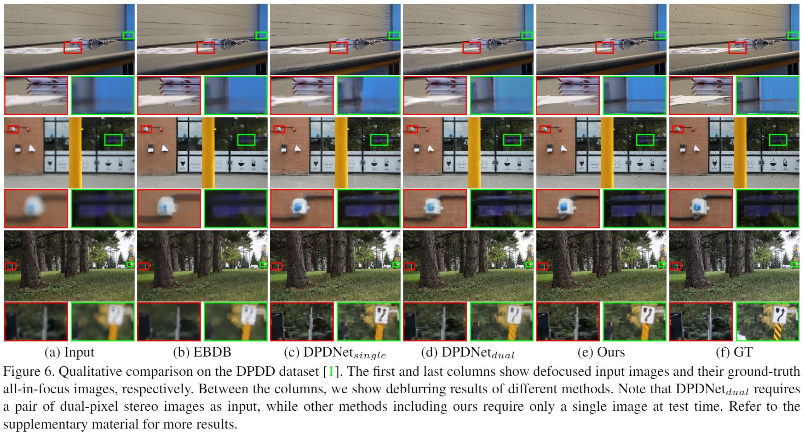

# Iterative Filter Adaptive Network for Single Image Defocus Deblurring




This repository contains the official PyTorch implementation of the following paper:

> **[Iterative Filter Adaptive Network for Single Image Defocus Deblurring (todo)](http://cg.postech.ac.kr/papers/2020_CGI_JY.pdf)**<br>
> Junyong Lee, Hyeongseok Son, Jaesung Rim, Sunghyun Cho, Seungyong Lee, CVPR2021

If you find this code useful, please consider citing:
```
@InProceedings{Lee_2021_CVPR,
author = {Lee, Junyong and Son, Hyeongseok and Rim, Jaesung and Cho, Sunghyun and Lee, Seungyong},
title = {Iterative Filter Adaptive Network for Single Image Defocus Deblurring},
booktitle = {The IEEE Conference on Computer Vision and Pattern Recognition (CVPR)},
month = {June},
year = {2021}
}
```

For any inquiries, please contact [junyonglee@postech.ac.kr](mailto:junyonglee@postech.ac.kr)

## Resources

All material related to our paper is available by following links:

| Link |
| :-------------- |
| [The main paper (todo)](https://drive.google.com/file/d/1mRVo3JefkgRd2VdJvG5M-8xWtvl60ZWg/view?usp=sharing) |
| [Supplementary Files (todo)](https://drive.google.com/file/d/1sQTGHEcko2HxoIvneyrot3bUabPrN5l1/view?usp=sharing) |
| [Checkpoint Files](https://www.dropbox.com/s/grxohabacw0h7hz/checkpoints.zip?dl=0) |
| [The DPDD dataset](https://github.com/Abdullah-Abuolaim/defocus-deblurring-dual-pixel) |
| [The CUHK dataset](http://www.cse.cuhk.edu.hk/~leojia/projects/dblurdetect/dataset.html) |
| [The PixelDP test set](https://ln2.sync.com/dl/ec54aa480/b28q2xma-9xa3w5tx-ss2cv7dg-2yx935qs/view/default/10770664900008) |
| [The RealDOF test set](https://www.dropbox.com/s/3l5gt3zz1zad5zl/RealDOF.zip?dl=0) |

## Training & testing of the network
### Training
```
# multi GPU (with DistributedDataParallel) example
CUDA_VISIBLE_DEVICES=0,1,2,3 python -B -m torch.distributed.launch --nproc_per_node=4 --master_port=9000 run.py \
--is_train \
--mode IFAN \
--config config_IFAN \
--trainer trainer \
--network IFAN \
-b 2 \
-th 8 \
-dl \
-dist

# single GPU (with DataParallel) example
CUDA_VISIBLE_DEVICES=0 python -B run.py \
--is_train \
--mode IFAN \
--config config_IFAN \
--trainer trainer \
--network IFAN \
-b 8 \
-th 8 \
-dl
```
* options
    * `--is_train`: If it is specified, `run.py` will train the network.  
    * `--mode`: The name of training mode. The logging folder named with the `mode` will be created under `./logs/Defocus_Deblurring/[mode]`. 
    * `--config`: The name of config file located as in `./config/[config].py`.
    * `--trainer`: The name of trainer  file located as in `./models/trainers/[trainer].py`.
    * `--network`: The name of network file located as in `./models/archs/[network].py`.
    * `-b`: The batch size. For the multi GPU (`DistributedDataParallel`), total batch size will be, `nproc_per_node * b`.
    * `-th`: The number of thread (`num_workers`) used for the data loader (defined in `./models/baseModel`).
    * `-dl`: The option whether to delete logs under `mode` (i.e., `./logs/Defocus_Deblurring/[mode]/*`). Option works only when `--is_train` is specified.
    * `-r`: Resume trining with specified epoch # (e.g., `-r 100`). Note that `-dl` should not be specified with this option.
    * `-dist`: whether to use `DistributedDataParallel`.

### Testing
```bash
python run.py --mode [MODE] --data [DATASET]
# e.g., python run.py --mode IFAN --data DPDD
```
* options
    * `--mode`: The name of the training mode that you want to test.
    * `--data`: The name of dataset for evaluation. We have `DPDD, RealDOF, CUHK, PixelDP`, and their path can be modified in `./configs/config.py`.
    * `-ckpt_name`: Load sthe checkpoint with the name of the checkpoint under `./logs/Defocus_Deblurring/[mode]/checkpoint/train/epoch/ckpt/` (e.g., `python run.py --mode IFAN --data DPDD --ckpt_name IFAN_00000.pytorch`).
    * `-ckpt_abs_name`. Loads the checkpoint of the absolute path (e.g., `python run.py --mode IFAN --data DPDD --ckpt_abs_name ./checkpoints/IFAN.pytorch`).
    * `-ckpt_epoch`: Loads the checkpoint of the specified epoch (e.g., `python run.py --mode IFAN --data DPDD --ckpt_epoch 0`). 
    * `-ckpt_sc`: Loads the checkpoint with the best validation score (e.g., `python run.py --mode IFAN --data DPDD --ckpt_sc`)    

## Testing with pre-trained weights of CVPR2021
1. Download pretrained weights from [here](https://www.dropbox.com/s/grxohabacw0h7hz/checkpoints.zip?dl=0).
Then, unzip them under `./checkpoints`.

2. (TODO) Download and Place test sets ([DPDD](https://github.com/Abdullah-Abuolaim/defocus-deblurring-dual-pixel), [RealDOF](https://www.dropbox.com/s/3l5gt3zz1zad5zl/RealDOF.zip?dl=0), [PixelDP](https://ln2.sync.com/dl/ec54aa480/b28q2xma-9xa3w5tx-ss2cv7dg-2yx935qs/view/default/10770664900008) and [CUHK](http://www.cse.cuhk.edu.hk/~leojia/projects/dblurdetect/dataset.html)) under `./test` (the offset can be modified in `./configs/config.py`).

3. To test the network, type:
* to test the final model 
```bash
# Our final model 
python run.py --mode IFAN --network IFAN --config config_IFAN --eval_mode quan --data DPDD --ckpt_abs_name checkpoints/IFAN.pytorch
```

* to test models used for evaluation
```bash
## Table 2 in the main paper
# The baseline model
python run.py --mode B --network B --config config_B --eval_mode quan --data DPDD --ckpt_abs_name checkpoints/B.pytorch

# D
python run.py --mode D --network D --config config_D --eval_mode quan --data DPDD --ckpt_abs_name checkpoints/D.pytorch

# F (TODO)
python run.py --mode F --network F --config config_F --eval_mode quan --data DPDD --ckpt_abs_name checkpoints/F.pytorch

# FD (TODO)
python run.py --mode FD --network FD --config config_FD --eval_mode quan --data DPDD --ckpt_abs_name checkpoints/FD.pytorch

# FR (TODO)
python run.py --mode FR --network F --config config_FR --eval_mode quan --data DPDD --ckpt_abs_name checkpoints/FR.pytorch

## Table 4 in the main paper
# Our final model with N=8 
python run.py --mode IFAN_8 --network IFAN --config config_IFAN_8 --eval_mode quan --data DPDD --ckpt_abs_name checkpoints/IFAN_8.pytorch

# Our final model with N=26
python run.py --mode IFAN_26 --network IFAN --config config_IFAN_26 --eval_mode quan --data DPDD --ckpt_abs_name checkpoints/IFAN_26.pytorch

# Our final model with N=35
python run.py --mode IFAN_35 --network IFAN --config config_IFAN_35 --eval_mode quan --data DPDD --ckpt_abs_name checkpoints/IFAN_35.pytorch

# Our final model with N=44
python run.py --mode IFAN_44 --network IFAN --config config_IFAN_44 --eval_mode quan --data DPDD --ckpt_abs_name checkpoints/IFAN_44.pytorch

## Table 5 in the main paper
# IFAN in which the IAC layer replaced with the FAC layer (TODO)
python run.py --mode IFAN_FAC --network IFAN_FAC --config config_IFAN_FAC --eval_mode quan --data DPDD --ckpt_abs_name checkpoints/IFAN_FAC.pytorch

## Table 1 in the supplementary material
# Our model trained with 16 bit images
python run.py --mode IFAN_16bit --network IFAN --config config_IFAN_16bit --eval_mode quan --data DPDD --ckpt_abs_name checkpoints/IFAN_16bit.pytorch

## Table 2 in the supplementary material
# Our model for dual-pixel stereo inputs
python run.py --mode IFAN_dual --network IFAN_dual --config config_IFAN --eval_mode quan --data DPDD --ckpt_abs_name checkpoints/IFAN_dual.pytorch
```

## License ##
This software is being made available under the terms in the [LICENSE](LICENSE) file.

Any exemptions to these terms requires a license from the Pohang University of Science and Technology.

## About Coupe Project ##
Project ‘COUPE’ aims to develop software that evaluates and improves the quality of images and videos based on big visual data. To achieve the goal, we extract sharpness, color, composition features from images and develop technologies for restoring and improving by using it. In addition,ersonalization technology through userreference analysis is under study.  
    
Please checkout out other Coupe repositories in our [Posgraph](https://github.com/posgraph) github organization.

## Useful Links ##
* [Coupe Library](http://coupe.postech.ac.kr/)
* [POSTECH CG Lab.](http://cg.postech.ac.kr/)
